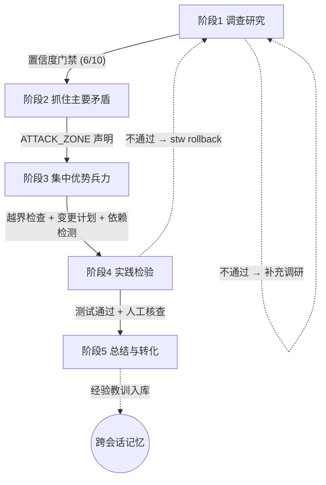

<p align="center">
  
</p>

<p align="center">
  📖 <a href="./assets/毛泽东选集.pdf"><strong>《毛泽东选集》（全五卷）PDF 下载</strong></a>
</p>

<h1 align="center">求是工作流</h1>
<p align="center"><em>将《毛泽东选集》哲学方法论转化为 AI 编程的结构化工作纪律。</em></p>

<p align="center">
  <a href="https://www.npmjs.com/package/seektruth-workflow"></a>
  <a href="https://nodejs.org"></a>
  
  <a href="./LICENSE"></a>
</p>

---

## 快速安装

不想手动配置？，按你的需求复制其中一个提示词给 Codex / Claude Code：

**A. 只安装求是工作流**

```text
请使用这个开源项目配置求是工作流：
https://github.com/Qinglianzihan/seektruth-workflow

目标：只安装/更新 seektruth-workflow，在当前项目里运行 stw init，选择当前 AI 工具，并告诉我以后如何用自然语言启动。
```

**B. 安装 RTK + 求是工作流**

```text
请同时使用这两个开源项目配置 RTK 和求是工作流：

RTK：
https://github.com/rtk-ai/rtk
用途：RTK 是更省 token 的 AI 编程命令层，可用 rtk stw ... 调用求是工作流。

求是工作流：
https://github.com/Qinglianzihan/seektruth-workflow

目标：安装/更新 RTK 和 seektruth-workflow，在当前项目里运行 stw init，选择当前 AI 工具。配置完成后，优先使用 rtk stw ...，并告诉我以后如何用自然语言启动。
```

AI 会完成：安装 CLI、初始化 `.stw/`、注入 Claude Code / Codex 需要的规则和 skills。之后你只要说：

```text
启动求是工作流，帮我处理：XXX
```

> 项目显示名叫「求是工作流」；npm 包名和命令名保持小写：`seektruth-workflow`、`stw`。

### 手动安装

要求 Node.js ≥ 18。

```bash
npm install -g seektruth-workflow
cd your-project
stw init
stw start --desc "你的任务描述"
```

更新：

```bash
npm update -g seektruth-workflow
```

`npm install` 只安装 `stw` CLI；`stw init` 才会检测 Claude/Codex/Cursor 等工具，并把工作流配置写入当前项目。

---

## 日常使用

### 自然语言

```text
启动求是工作流，帮我修复登录失败的问题。
```

先讨论需求：

```text
用求是工作流的需求炼金炉讨论这个想法：AI 狼人杀。
```

### 常用命令

```bash
stw status                 # 查看当前阶段
stw next                   # 推进阶段并运行门禁
stw rollback <原因>        # 回到阶段 1 重新调查
stw report                 # 归档总结
stw repair                 # 重生成 .stw / 工具配置
```

Claude Code 用户也可以在对话里用：

```text
/stw status
/stw next
/stw report
```

---

## 支持的 AI 工具

`stw init` 会自动检测工具，并生成对应规则/skills。

| 工具 | 注入方式 |
|:---|:---|
| Claude Code | `.claude-plugin` + `CLAUDE.md` + `.claude/skills/stw.md` + 原生 skills |
| Codex CLI | `.codex-plugin` + `AGENTS.md` + 原生 skills |
| Cursor / Cline / OpenCode / Windsurf / Copilot / Aider | 对应 rules 文件 |

生成的原生 skills 位于：

```text
skills/using-stw/SKILL.md
skills/stw-*/SKILL.md
skills/skill-maintenance/SKILL.md
```

## 解决了什么问题

AI 编程助手在长任务中普遍出现上下文腐化、目标漂移、越界修改、盲目信任等问题。求是工作流用毛选方法论建立纪律约束：

| 痛点 | 方法论 | 落地 |
|:---|:---|:---|
| AI 不读代码就写 | 「没有调查就没有发言权」 | 阶段 1 六步认知分析 |
| 凭想象断言 | 「反对主观主义」 | 每条结论标注 (file:line) |
| 乱改无关文件 | 「集中优势兵力」 | ATTACK_ZONE 越界封锁 |
| 随意加依赖 | 「反对党八股」 | 变更计划声明 + 依赖检测 |
| 下次忘记上次的坑 | 「惩前毖后，治病救人」 | 经验教训 + 错误病例跨会话 |
| 用户盲目信任 | 「实践是真理的唯一标准」 | 人工核查清单 |

### v0.4 新增（harness 工程化升级）

基于 Harness Engineering 七源交叉共识（Osmani / Anthropic ×2 / OpenAI / LangChain / AHE / HES v1）与《毛选》方法论对位：

- **Ralph Loop hooks**：Claude Code `PostToolUse`（编辑后跑质量门禁）+ `Stop`（阶段 1-4 拦退出、重注入原意）。
- **Observability**：`events.jsonl` 事件流 + `stw replay` 根因追溯，`stw analyze` 按失败模式归类最近 N 次任务。
- **Harness 自审**：`stw audit` 按 5 大约束统计触发率，配合精简宪章剔 dead weight（"Harnesses don't shrink, they move"）。
- **doc-drift 反向校验**：`stw check doc-drift` 扫派生文档与 roadmap 是否过期。
- **证据链契约**：Analysis §4.5 预测 + Summary §7 账本对账，归档时 mismatch 自动入病例库。
- **Loop detection**：同一文件 N 次编辑触发 `stderr` 提示（本段就是该机制现场触发的产物）。
- **Skill Issue 归因**：error-registry 按 `harness / model / description` 分类，量化哪类问题可靠纪律解决。

---

## 工作流



| 阶段 | 做什么 | 交付物 | 推进条件 |
|:---|:---|:---|:---|
| **1. 调查研究** | 需求澄清 + 外部调研 + 风格侦察 + 六步分析 + 变更计划 | `Analysis-Template.md` | 置信度 ≥ 6/10（12 项检查） |
| **2. 抓住主要矛盾** | 声明 ATTACK_ZONE 作战区域 | `STW-Workspace.md` | 包含有效的 ATTACK_ZONE |
| **3. 集中优势兵力** | 按计划修改代码 | `lockdown.json` | 文件越界 + 变更计划 + 依赖 |
| **4. 实践检验** | 运行测试 + 审查 | `test-results.json` | 测试通过 + 人工核查 5 项 |
| **5. 总结与转化** | 记录认知迭代、经验教训、错误病例 | `Summary-Template.md` | 总结填写完成 |

---

## 命令

```bash
stw forge "AI狼人杀"       # 需求炼金炉：多 agent 讨论需求
stw init                   # 初始化项目
stw init --deep            # 初始化 + 深度扫描 MCP 工具
stw start --desc "..."     # 开始任务（保存描述，中途可对照检查）
stw start --force          # 跳过 git 脏工作树检查
stw status                 # 进度、运行时长、回滚迭代
stw next                   # 推进阶段（自动门禁检查）
stw next --scope-check     # 推进前对照原始需求
stw rollback <原因>        # 回退阶段 1，保留分析记录
stw abort                  # 中止任务
stw report                 # 归档总结（经验教训跨会话复用）
stw stats                  # Token / 会话 / 错误统计
stw stats --log-tokens <N> # 记录 Token 消耗
stw repair                 # 修复/重生成 .stw 文件
stw check [gate]           # 运行质量门禁 (lint / ratchet / test / doc-drift / evidence)
stw hook run               # AI 工具 PostToolUse hook 入口（Claude Code 编辑后自动触发）
stw stop-hook run          # Ralph Loop Stop hook：阶段 1-4 拦退出、重注入原意
stw replay [--tail N]      # 回放 events.jsonl 事件流（--type / --task / --root-cause / --json）
stw audit [--limit N]      # 审计 5 大约束最近 N 任务触发情况，剔 dead weight
stw analyze [--limit N]    # 失败模式归类 + predictionVerdict 趋势 + session 负载
stw ratchet list|add|remove  # 管理 Ratchet 规则（每错变规则）
stw registry clean|stats   # 错误病例库管理（category 归因 / tag 规范化）
```

重复运行 `stw init` / `stw repair` 不会直接丢弃旧记录；已有 `.stw` 文档被刷新前会自动备份到 `.stw/history/<时间戳>/`，历史 reports、stats、error registry 会保留。

---

## 哲学映射

| 概念 | 出处 | 实现 |
|:---|:---|:---|
| 调查研究 | 《反对本本主义》 | 六步认知分析 |
| 从群众中来 | 《关于领导方法的若干问题》 | 项目风格侦察 |
| 反对主观主义 | 《反对本本主义》 | (file:line) 强制引用 |
| 反对党八股 | 《反对党八股》 | 变更计划 WHAT+WHY |
| 集中优势兵力 | 《中国革命战争的战略问题》 | ATTACK_ZONE 封锁 |
| 实践论 | 《实践论》 | 测试 + 人工核查 |
| 不打无把握之仗 | 《目前形势和我们的任务》 | 置信度门禁 |
| 波浪式前进 | 《中国革命战争的战略问题》 | 回滚迭代 |
| 惩前毖后 | 《整顿党的作风》 | 错误病例 + 经验教训 |

---

<p align="center"><em>"读书是学习，使用也是学习，而且是更重要的学习。"</em></p>

<p align="center">MIT · v0.4.1 · 516 tests · <a href="https://github.com/Qinglianzihan/seektruth-workflow">GitHub</a></p>
