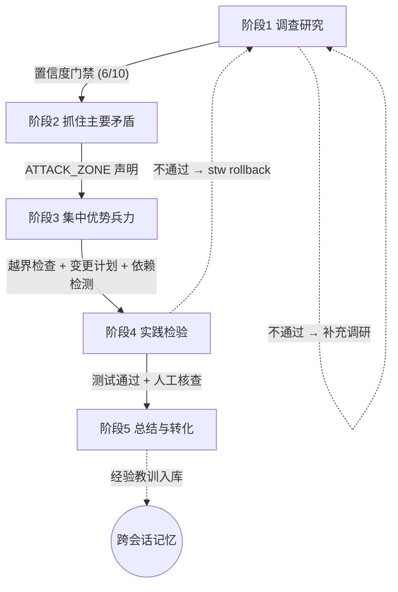

<p align="center">
  
</p>

<p align="center">
  📖 <a href="./assets/毛泽东选集.pdf"><strong>《毛泽东选集》（全五卷）PDF 下载</strong></a>
</p>

<h1 align="center">求是工作流</h1>
<p align="center"><em>将《毛泽东选集》哲学方法论转化为 AI 编程的结构化工作纪律。</em></p>

<p align="center">
  <a href="https://www.npmjs.com/package/seektruth-workflow"></a>
  <a href="https://nodejs.org"></a>
  
  <a href="./LICENSE"></a>
</p>

---

## 快速安装

```bash
npm install -g seektruth-workflow
```

更新到最新版：

```bash
npm update -g seektruth-workflow
```

要求 Node.js ≥ 18。

## 一分钟上手

```bash
cd your-project
stw init                            # 一次性：侦察项目环境，生成 .stw/
stw start --desc "你的任务描述"      # 开始任务 → 进入阶段 1
stw next                            # 按流程推进，AI 完成每阶段交付物后执行
```

每一步 `stw next` 自动检查交付物、置信度、越界修改、变更计划，不通过不推进。

## 在 AI 编程工具中使用

`stw init` 自动检测当前环境中的 AI 工具，为每种工具注入对应的项目配置文件，AI 会话自动加载工作流规范。

### 工具支持一览

| 工具 | 自动注入方式 | 命令执行方式 |
|:---|:---|:---|
| **Claude Code** | `.claude-plugin` + `skills/` + `CLAUDE.md` + `.claude/skills/stw.md` | 原生 Skill `using-stw` + `/stw` 命令 |
| **Codex CLI** | `.codex-plugin` + `skills/` + `AGENTS.md` | 原生 Skill `using-stw` + 终端 `rtk stw next` |
| **Cursor** | `.cursorrules` | 终端 `stw next` |
| **Cline** | `.clinerules` | 终端 `stw next` |
| **OpenCode** | `OPenCODE.md` | 终端 `stw next` |
| **Windsurf** | `.windsurfrules` | 终端 `stw next` |
| **GitHub Copilot** | `.github/copilot-instructions.md` | 终端 `stw next` |
| **Aider** | `.aiderrules` | 终端 `stw next` |

### 原生 Skill / Plugin 模式

`stw init` 会生成：

```text
.codex-plugin/plugin.json
.claude-plugin/plugin.json
skills/using-stw/SKILL.md
skills/stw-*/SKILL.md
```

Codex 可将 `skills/` 链接到原生发现目录：

```powershell
New-Item -ItemType Directory -Force -Path "$env:USERPROFILE\.agents\skills"
cmd /c mklink /J "%USERPROFILE%\.agents\skills\stw" "<项目路径>\skills"
```

重启 Codex 后，开发类任务会触发 `using-stw`，先执行 `rtk stw status/start`，再按阶段调用对应 Skill。
### 通用流程

```bash
stw init              # 一次性：生成 .stw/ + 自动注入工具配置
stw start --desc "任务描述"

# → 告诉 AI: "读取 .stw/STW-Workspace.md，按规范完成任务"
# → AI 填写分析报告、修改代码
# → 你运行 stw next 把关（Claude Code 用户可直接 /stw next）
```

**核心不变**：AI 负责执行，`stw next` 负责把关。门禁不通过，AI 继续改。

### 需求炼金炉

在 Codex / Claude CLI 里可以直接说：

> 我想做 AI狼人杀，先用 STW 需求炼金炉讨论，不要直接开发。

等价命令：

```powershell
stw forge "AI狼人杀"
stw forge run          # 默认调用当前 Codex CLI；Claude 用 --provider claude
stw forge next         # 生成 .stw/forge/questions.md
stw forge accept "用户确认后的方向和范围"
stw status             # 已进入 STW 阶段 1
```

`forge` 采用“主持人状态机 + 多专家独立产出”，生成 `.stw/forge/session.json`、agent 状态文件、讨论黑板、确认问题和 `.stw/forge/requirements.md`。`forge accept` 会把需求固化并启动五阶段工作流，不再停在讨论层。

如需外部 API，使用 `stw forge run --provider api`，再设置 `STW_LLM_API_KEY`、`STW_LLM_BASE_URL`、`STW_LLM_MODEL`。

### Claude Code（对话中操作）

```bash
stw init    # 自动创建 Skill + CLAUDE.md
```

然后在对话中：

```
/STW status     ← 直接在对话中推进！
/STW next       ← 门禁自动检查
/STW rollback   ← 需求变化回退
/STW report     ← 归档总结
```

不需要切回终端，一气呵成。

---

## 解决了什么问题

AI 编程助手在长任务中普遍出现上下文腐化、目标漂移、越界修改、盲目信任等问题。求是工作流用毛选方法论建立纪律约束：

| 痛点 | 方法论 | 落地 |
|:---|:---|:---|
| AI 不读代码就写 | 「没有调查就没有发言权」 | 阶段 1 六步认知分析 |
| 凭想象断言 | 「反对主观主义」 | 每条结论标注 (file:line) |
| 乱改无关文件 | 「集中优势兵力」 | ATTACK_ZONE 越界封锁 |
| 随意加依赖 | 「反对党八股」 | 变更计划声明 + 依赖检测 |
| 下次忘记上次的坑 | 「惩前毖后，治病救人」 | 经验教训 + 错误病例跨会话 |
| 用户盲目信任 | 「实践是真理的唯一标准」 | 人工核查清单 |

---

## 工作流



| 阶段 | 做什么 | 交付物 | 推进条件 |
|:---|:---|:---|:---|
| **1. 调查研究** | 需求澄清 + 外部调研 + 风格侦察 + 六步分析 + 变更计划 | `Analysis-Template.md` | 置信度 ≥ 6/10（12 项检查） |
| **2. 抓住主要矛盾** | 声明 ATTACK_ZONE 作战区域 | `STW-Workspace.md` | 包含有效的 ATTACK_ZONE |
| **3. 集中优势兵力** | 按计划修改代码 | `lockdown.json` | 文件越界 + 变更计划 + 依赖 |
| **4. 实践检验** | 运行测试 + 审查 | `test-results.json` | 测试通过 + 人工核查 5 项 |
| **5. 总结与转化** | 记录认知迭代、经验教训、错误病例 | `Summary-Template.md` | 总结填写完成 |

---

## 命令

```bash
stw forge "AI狼人杀"       # 需求炼金炉：多 agent 讨论需求
stw init                   # 初始化项目
stw init --deep            # 初始化 + 深度扫描 MCP 工具
stw start --desc "..."     # 开始任务（保存描述，中途可对照检查）
stw start --force          # 跳过 git 脏工作树检查
stw status                 # 进度、运行时长、回滚迭代
stw next                   # 推进阶段（自动门禁检查）
stw next --scope-check     # 推进前对照原始需求
stw rollback <原因>        # 回退阶段 1，保留分析记录
stw abort                  # 中止任务
stw report                 # 归档总结（经验教训跨会话复用）
stw stats                  # Token / 会话 / 错误统计
stw stats --log-tokens <N> # 记录 Token 消耗
stw repair                 # 修复/重生成 .stw 文件
```

---

## 哲学映射

| 概念 | 出处 | 实现 |
|:---|:---|:---|
| 调查研究 | 《反对本本主义》 | 六步认知分析 |
| 从群众中来 | 《关于领导方法的若干问题》 | 项目风格侦察 |
| 反对主观主义 | 《反对本本主义》 | (file:line) 强制引用 |
| 反对党八股 | 《反对党八股》 | 变更计划 WHAT+WHY |
| 集中优势兵力 | 《中国革命战争的战略问题》 | ATTACK_ZONE 封锁 |
| 实践论 | 《实践论》 | 测试 + 人工核查 |
| 不打无把握之仗 | 《目前形势和我们的任务》 | 置信度门禁 |
| 波浪式前进 | 《中国革命战争的战略问题》 | 回滚迭代 |
| 惩前毖后 | 《整顿党的作风》 | 错误病例 + 经验教训 |

---

<p align="center"><em>"读书是学习，使用也是学习，而且是更重要的学习。"</em></p>

<p align="center">MIT · v0.3.0 · 164 tests · <a href="https://github.com/Qinglianzihan/seektruth-workflow">GitHub</a></p>


